# Building Your First RESTful API with Java Spring Boot: A Complete Walkthrough

## Introduction

Modern web applications rely heavily on APIs (Application Programming Interfaces) to enable communication between different software systems. In this guide, I'll walk you through building a production-ready RESTful API using Java and Spring Boot—one of the most popular frameworks in enterprise application development.

By the end of this article, you'll have built and deployed a fully functional API that serves personal profile information alongside dynamic data fetched from an external API. More importantly, you'll understand the core concepts that power millions of enterprise applications worldwide.

**What we'll build:** A RESTful endpoint that returns JSON-formatted profile data combined with random cat facts from an external API, deployed to a cloud platform for public access.


---

## Understanding the Fundamentals

### What is a REST API?

REST (Representational State Transfer) is an architectural style for designing networked applications. Think of it as a set of rules for how applications should communicate over HTTP.

A RESTful API uses standard HTTP methods:
- **GET** - Retrieve data
- **POST** - Create new data
- **PUT** - Update existing data
- **DELETE** - Remove data

In our case, we're building a GET endpoint that retrieves profile information.

### Why Spring Boot?

Spring Boot is a framework that simplifies Java application development by providing:
- **Auto-configuration**: Sensible defaults that reduce boilerplate code
- **Embedded server**: No need to deploy to external servers during development
- **Production-ready features**: Metrics, health checks, and externalized configuration
- **Vast ecosystem**: Extensive libraries for database access, security, and more

It's the go-to choice for building microservices and enterprise applications in the Java ecosystem.

### Key Technologies We'll Use

1. **Maven**: Build automation tool that manages dependencies and project lifecycle
2. **Lombok**: Library that reduces boilerplate code through annotations
3. **Jackson**: JSON serialization/deserialization library (included with Spring Boot)
4. **RestTemplate**: Spring's HTTP client for consuming external APIs
5. **Railway**: Cloud platform for deploying applications

---

## Project Requirements

Our API must satisfy these specifications:

### Endpoint Structure
- **Path**: `/me`
- **Method**: GET
- **Content-Type**: `application/json`

### Response Format
```json
{
  "status": "success",
  "user": {
    "email": "your.email@example.com",
    "name": "Your Full Name",
    "stack": "Java/Spring Boot"
  },
  "timestamp": "2025-10-18T14:30:45.123Z",
  "fact": "Random cat fact from external API"
}
```

### Technical Requirements
- Dynamic timestamp in ISO 8601 format
- Fresh cat fact fetched on every request
- Proper error handling for external API failures
- Comprehensive unit and integration tests
- Cloud deployment (Railway, Heroku, AWS, etc.)

---

## Setting Up the Development Environment

### Prerequisites

Before we begin, ensure you have:

1. **Java Development Kit (JDK) 17+**
   - Download from [Adoptium](https://adoptium.net/)
   - Verify: `java -version`

2. **Maven 3.6+**
   - Usually comes with modern IDEs
   - Verify: `mvn -version`

3. **IDE** (Choose one)
   - IntelliJ IDEA Community Edition (recommended)
   - Visual Studio Code with Java extensions

4. **Git** for version control

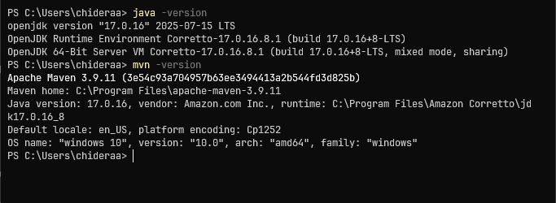

---

## Step 1: Project Initialization

### Using Spring Initializr

Spring Initializr is a web-based tool that generates Spring Boot project skeletons.

1. Navigate to [start.spring.io](https://start.spring.io)
2. Configure your project:
   - **Project**: Maven
   - **Language**: Java
   - **Spring Boot**: 3.4.1 (or latest stable)
   - **Group**: `com.yourname` (e.g., `com.chideraau`)
   - **Artifact**: `profile-api`
   - **Packaging**: Jar
   - **Java**: 17

3. Add dependencies:
   - **Spring Web** - For building REST APIs
   - **Spring Boot DevTools** - For automatic restarts during development
   - **Lombok** - To reduce boilerplate code

4. Click **Generate** and extract the downloaded zip file


### Understanding the Generated Structure

```
profile-api/
├── src/
│   ├── main/
│   │   ├── java/                  # Source code
│   │   └── resources/              # Configuration files
│   └── test/                       # Test code
├── pom.xml                         # Maven configuration
└── README.md
```

The `pom.xml` file is the heart of a Maven project. It defines:
- Project metadata (group, artifact, version)
- Dependencies (external libraries)
- Build configuration
- Plugins for packaging and deployment

---

## Step 2: Building the Data Model

Our first task is to define the structure of our API response. This is where we create the **model** or **DTO** (Data Transfer Object).

### Understanding Nested JSON Structures

Our response has a nested structure—a `user` object inside the main response. In Java, we model this using inner classes.

Create `ProfileResponse.java`:

```java
package com.chideraau.profile_api.model;

import com.fasterxml.jackson.annotation.JsonProperty;
import lombok.AllArgsConstructor;
import lombok.Builder;
import lombok.Data;
import lombok.NoArgsConstructor;

@Data
@Builder
@AllArgsConstructor
@NoArgsConstructor
public class ProfileResponse {
    
    private String status;
    
    @JsonProperty("user")
    private UserInfo user;
    
    private String timestamp;
    private String fact;
    
    @Data
    @Builder
    @AllArgsConstructor
    @NoArgsConstructor
    public static class UserInfo {
        private String email;
        private String name;
        private String stack;
    }
}
```

### Breaking Down the Annotations

**Lombok Annotations** (reduce boilerplate):
- `@Data`: Generates getters, setters, `toString()`, `equals()`, and `hashCode()`
- `@Builder`: Enables fluent object creation (e.g., `ProfileResponse.builder().status("success").build()`)
- `@AllArgsConstructor`: Creates constructor with all fields
- `@NoArgsConstructor`: Creates no-argument constructor (required by Jackson)

**Jackson Annotations** (control JSON serialization):
- `@JsonProperty("user")`: Maps the `user` field to the JSON key

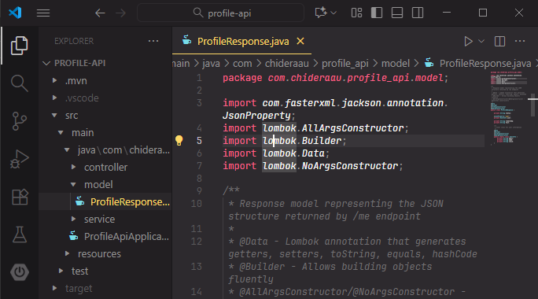

---

## Step 3: Creating the External API Service

To fetch cat facts, we need a service that communicates with the external API at `https://catfact.ninja/fact`.

### The Service Layer Pattern

In enterprise applications, we separate concerns using layers:
- **Controller Layer**: Handles HTTP requests/responses
- **Service Layer**: Contains business logic
- **Repository Layer**: Handles data persistence (not used in this project)

Create `CatFactService.java`:

```java
package com.chideraau.profile_api.service;

import com.fasterxml.jackson.databind.JsonNode;
import com.fasterxml.jackson.databind.ObjectMapper;
import org.slf4j.Logger;
import org.slf4j.LoggerFactory;
import org.springframework.stereotype.Service;
import org.springframework.web.client.RestTemplate;
import org.springframework.web.client.ResourceAccessException;

@Service
public class CatFactService {
    
    private static final Logger logger = LoggerFactory.getLogger(CatFactService.class);
    private static final String CAT_FACT_API_URL = "https://catfact.ninja/fact";
    private static final String FALLBACK_FACT = "Cats are amazing creatures!";
    
    private final RestTemplate restTemplate;
    private final ObjectMapper objectMapper;
    
    public CatFactService() {
        this.restTemplate = new RestTemplate();
        this.objectMapper = new ObjectMapper();
    }
    
    public String getRandomCatFact() {
        try {
            logger.info("Fetching cat fact from: {}", CAT_FACT_API_URL);
            
            String response = restTemplate.getForObject(CAT_FACT_API_URL, String.class);
            
            if (response == null) {
                logger.warn("Received null response from Cat Facts API");
                return FALLBACK_FACT;
            }
            
            JsonNode jsonNode = objectMapper.readTree(response);
            String fact = jsonNode.get("fact").asText();
            
            logger.info("Successfully fetched cat fact");
            return fact;
            
        } catch (ResourceAccessException e) {
            logger.error("Network error while fetching cat fact: {}", e.getMessage());
            return FALLBACK_FACT;
        } catch (Exception e) {
            logger.error("Error fetching cat fact: {}", e.getMessage(), e);
            return FALLBACK_FACT;
        }
    }
}
```

### Key Design Decisions

**1. Graceful Degradation**: Instead of failing completely when the external API is down, we return a fallback message. This is crucial for production applications.

**2. Logging**: We use SLF4J for structured logging, which helps with debugging and monitoring in production.

**3. RestTemplate**: Spring's HTTP client that simplifies API calls. We call `getForObject()` to make a GET request and receive the response as a String.

**4. JSON Parsing**: We use Jackson's `ObjectMapper` to parse the JSON response and extract the `fact` field.

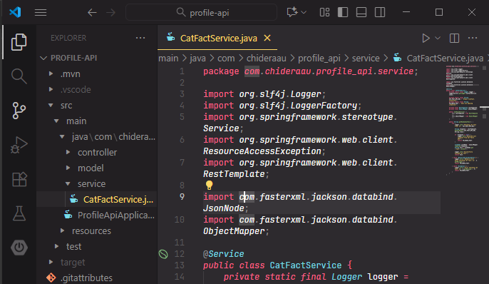

---

## Step 4: Building the Controller

The controller is where HTTP requests are mapped to Java methods. This is the entry point for our API.

Create `ProfileController.java`:

```java
package com.chideraau.profile_api.controller;

import java.time.Instant;
import org.springframework.beans.factory.annotation.Autowired;
import org.springframework.http.ResponseEntity;
import org.springframework.web.bind.annotation.GetMapping;
import org.springframework.web.bind.annotation.RestController;
import com.chideraau.profile_api.model.ProfileResponse;
import com.chideraau.profile_api.service.CatFactService;

@RestController
public class ProfileController {
    
    @Autowired
    private CatFactService catFactService;

    @GetMapping("/me")
    public ResponseEntity<ProfileResponse> getProfile() {
        String catFact = catFactService.getRandomCatFact();
        String timestamp = Instant.now().toString();
        
        ProfileResponse.UserInfo userInfo = ProfileResponse.UserInfo.builder()
                .email("your.email@example.com")
                .name("Your Full Name")
                .stack("Java/Spring Boot")
                .build();
        
        ProfileResponse response = ProfileResponse.builder()
                .status("success")
                .user(userInfo)
                .timestamp(timestamp)
                .fact(catFact)
                .build();

        return ResponseEntity.ok(response);
    }
}
```

### Understanding Controller Annotations

**`@RestController`**: Combines `@Controller` and `@ResponseBody`. This tells Spring:
1. This class handles web requests
2. Return values should be serialized to JSON (not rendered as HTML views)

**`@GetMapping("/me")`**: Maps HTTP GET requests to the `/me` path to this method.

**`@Autowired`**: Tells Spring to automatically inject an instance of `CatFactService`. This is **Dependency Injection**—a core principle of Spring.

### The Builder Pattern in Action

Notice how we build objects:

```java
ProfileResponse.UserInfo userInfo = ProfileResponse.UserInfo.builder()
    .email("your.email@example.com")
    .name("Your Full Name")
    .stack("Java/Spring Boot")
    .build();
```

This is much cleaner than:
```java
ProfileResponse.UserInfo userInfo = new ProfileResponse.UserInfo();
userInfo.setEmail("your.email@example.com");
userInfo.setName("Your Full Name");
userInfo.setStack("Java/Spring Boot");
```

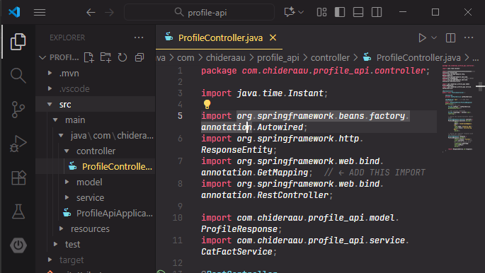

---

## Step 5: Configuration

Create `application.properties` in `src/main/resources/`:

```properties
# Server Configuration
server.port=8080

# Application Name
spring.application.name=profile-api

# Logging Configuration
logging.level.root=INFO
logging.level.com.chideraau.profile_api=DEBUG

# JSON Configuration
spring.jackson.default-property-inclusion=non_null
spring.jackson.serialization.write-dates-as-timestamps=false
```

These properties configure:
- Server port (8080 is the default)
- Logging levels for debugging
- Jackson JSON serialization behavior

---

## Step 6: Testing the Application Locally

### Running the Application

From your project root:

```bash
mvn clean install
mvn spring-boot:run
```

You should see output like:

```
  .   ____          _            __ _ _
 /\\ / ___'_ __ _ _(_)_ __  __ _ \ \ \ \
( ( )\___ | '_ | '_| | '_ \/ _` | \ \ \ \
 \\/  ___)| |_)| | | | | || (_| |  ) ) ) )
  '  |____| .__|_| |_|_| |_\__, | / / / /
 =========|_|==============|___/=/_/_/_/

Started ProfileApiApplication in 2.345 seconds
```

[IMAGE_PLACEHOLDER: Screenshot of successful application startup in terminal]

### Testing the Endpoint

Open your browser or use curl:

```bash
curl http://localhost:8080/me
```

Expected response:

```json
{
  "status": "success",
  "user": {
    "email": "your.email@example.com",
    "name": "Your Full Name",
    "stack": "Java/Spring Boot"
  },
  "timestamp": "2025-10-18T15:30:45.123Z",
  "fact": "A cat's brain is biologically more similar to a human brain than it is to a dog's."
}
```

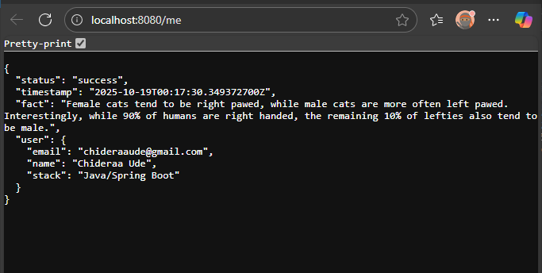

---

## Step 7: Writing Tests

Testing is crucial for maintaining code quality. Spring Boot provides excellent testing support.

### Unit Tests with @WebMvcTest

Create `ProfileControllerTest.java` in `src/test/java/com/chideraau/profile_api/controller/`:

```java
package com.chideraau.profile_api.controller;

import com.chideraau.profile_api.service.CatFactService;
import org.junit.jupiter.api.Test;
import org.springframework.beans.factory.annotation.Autowired;
import org.springframework.boot.test.autoconfigure.web.servlet.WebMvcTest;
import org.springframework.test.context.bean.override.mockito.MockitoBean;
import org.springframework.test.web.servlet.MockMvc;

import static org.mockito.Mockito.when;
import static org.springframework.test.web.servlet.request.MockMvcRequestBuilders.get;
import static org.springframework.test.web.servlet.result.MockMvcResultMatchers.*;

@WebMvcTest(ProfileController.class)
public class ProfileControllerTest {

    @Autowired
    private MockMvc mockMvc;

    @MockitoBean
    private CatFactService catFactService;

    @Test
    public void testGetProfile_ReturnsCorrectStructure() throws Exception {
        String mockCatFact = "Cats can rotate their ears 180 degrees.";
        when(catFactService.getRandomCatFact()).thenReturn(mockCatFact);

        mockMvc.perform(get("/me"))
                .andExpect(status().isOk())
                .andExpect(content().contentType("application/json"))
                .andExpect(jsonPath("$.status").value("success"))
                .andExpect(jsonPath("$.user.email").exists())
                .andExpect(jsonPath("$.user.name").exists())
                .andExpect(jsonPath("$.user.stack").exists())
                .andExpect(jsonPath("$.timestamp").exists())
                .andExpect(jsonPath("$.fact").value(mockCatFact));
    }
}
```

**Key Testing Concepts:**

- **`@WebMvcTest`**: Loads only the web layer, not the entire application context (faster tests)
- **`@MockitoBean`**: Creates a mock of `CatFactService` so we control what it returns
- **`MockMvc`**: Simulates HTTP requests without starting a full server
- **JSONPath**: Query language for verifying JSON structure (similar to XPath for XML)

### Integration Tests

Create `ProfileApiApplicationTests.java` in `src/test/java/com/chideraau/profile_api/`:

```java
package com.chideraau.profile_api;

import org.junit.jupiter.api.Test;
import org.springframework.beans.factory.annotation.Autowired;
import org.springframework.boot.test.context.SpringBootTest;
import org.springframework.boot.test.web.client.TestRestTemplate;
import org.springframework.boot.test.web.server.LocalServerPort;
import org.springframework.http.HttpStatus;
import org.springframework.http.ResponseEntity;

import static org.assertj.core.api.Assertions.assertThat;

@SpringBootTest(webEnvironment = SpringBootTest.WebEnvironment.RANDOM_PORT)
class ProfileApiApplicationTests {

    @LocalServerPort
    private int port;

    @Autowired
    private TestRestTemplate restTemplate;

    @Test
    void testMeEndpoint_Returns200() {
        ResponseEntity<String> response = restTemplate.getForEntity(
                "http://localhost:" + port + "/me",
                String.class
        );
        
        assertThat(response.getStatusCode()).isEqualTo(HttpStatus.OK);
    }

    @Test
    void testMeEndpoint_ContainsRequiredFields() {
        ResponseEntity<String> response = restTemplate.getForEntity(
                "http://localhost:" + port + "/me",
                String.class
        );
        
        String body = response.getBody();
        assertThat(body).contains("\"status\"", "\"user\"", "\"email\"", 
                                  "\"name\"", "\"stack\"", "\"timestamp\"", "\"fact\"");
    }
}
```

Integration tests start the full application and make real HTTP requests, ensuring all components work together.

### Running Tests

```bash
mvn test
```

Expected output:

```
Tests run: 10, Failures: 0, Errors: 0, Skipped: 0

BUILD SUCCESS
```


---

# Step 8: Deploying to AWS EC2 with NGINX (Production-Ready Setup)

While Platform-as-a-Service (PaaS) solutions like Render offer convenience, deploying to AWS EC2 with NGINX provides full control over your infrastructure and demonstrates valuable DevOps skills that employers look for.

## Why AWS EC2 + NGINX?

This deployment approach offers several advantages:

**Professional Setup:**
- Mirrors real-world production environments
- Full control over server configuration
- Scalable architecture
- Industry-standard technology stack

**Learning Opportunities:**
- Linux system administration
- Web server configuration (NGINX)
- Process management (systemd)
- Security hardening
- Cloud infrastructure (AWS)

**Cost-Effective:**
- AWS Free Tier: 750 hours/month for 12 months
- After free tier: ~$10-15/month
- Predictable, scalable pricing

## Understanding the Architecture

Before we deploy, let's understand what we're building:

```
┌─────────────────────────────────────────────────┐
│              Internet (Port 80/443)              │
└──────────────────┬──────────────────────────────┘
                   │
                   ▼
         ┌─────────────────┐
         │   AWS EC2       │
         │  Ubuntu 22.04   │
         │   (t3.micro)    │
         └────────┬────────┘
                  │
       ┌──────────┴──────────┐
       │                     │
       ▼                     ▼
┌─────────────┐      ┌──────────────┐
│   NGINX     │      │  Spring Boot │
│  (Port 80)  │─────▶│  (Port 8080) │
│Rev. Proxy   │      │  Application │
└─────────────┘      └──────────────┘
       │                     │
       │                     ▼
       │            ┌─────────────────┐
       │            │  External API   │
       │            │ (catfact.ninja) │
       │            └─────────────────┘
       │
       ▼
┌──────────────┐
│  SSL/TLS     │
│(Let's Encrypt)│
└──────────────┘
```

**Key Components:**

1. **AWS EC2**: Virtual server running Ubuntu Linux
2. **NGINX**: Reverse proxy server that:
   - Receives public HTTP/HTTPS requests
   - Forwards them to Spring Boot on port 8080
   - Handles SSL termination
   - Provides security layer
3. **systemd**: Keeps Spring Boot running and restarts on failure
4. **Spring Boot**: Our application running on port 8080 (not directly accessible from internet)

**Why use NGINX instead of exposing Spring Boot directly?**

- **Security**: NGINX acts as a security buffer
- **SSL/TLS**: NGINX handles certificate management
- **Performance**: NGINX efficiently serves static content
- **Flexibility**: Easy to add caching, load balancing, multiple apps

---

## Part 1: Setting Up AWS EC2

### Step 1.1: Create an AWS Account

1. Visit [aws.amazon.com](https://aws.amazon.com)
2. Click "Create an AWS Account"
3. Enter your email and create a password
4. Provide contact information
5. Add payment method (required but won't be charged on free tier)
6. Verify identity via phone
7. Select "Free" support plan

**Free Tier Benefits:**
- 750 hours/month of t3.micro instance (12 months)
- 30 GB of EBS storage
- 15 GB data transfer out

### Step 1.2: Launch Your EC2 Instance

1. **Sign in to AWS Console**
2. **Select Region**: Choose closest to your target audience
   - US East (N. Virginia): `us-east-1`
   - Europe (London): `eu-west-2`
   - Asia Pacific (Singapore): `ap-southeast-1`

3. **Navigate to EC2**: Services → Compute → EC2

4. **Click "Launch Instance"**

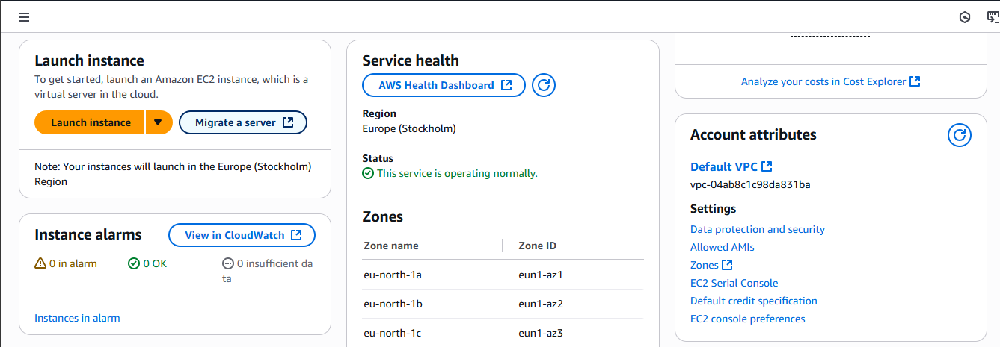

### Step 1.3: Configure Your Instance

#### Basic Configuration

**Name and tags:**
```
Name: profile-api-server
Environment: production
```

**Application and OS Images (AMI):**
- Search: "Ubuntu"
- Select: **Ubuntu Server 22.04 LTS (HVM), SSD Volume Type**
- Architecture: **64-bit (x86)**
- Note the "Free tier eligible" label ✅

**Why Ubuntu 22.04?**
- Long-term support (LTS) until 2027
- Excellent documentation
- Large community support
- Widely used in production

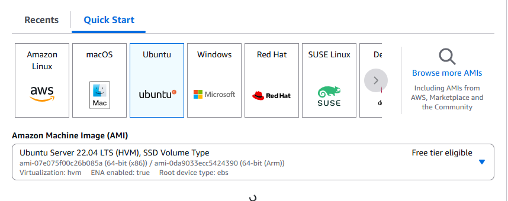

#### Instance Type

**Select:** `t3.micro`

**Specifications:**
- 1 vCPU
- 1 GB RAM
- Low to moderate network performance
- **Free tier eligible** ✅

This is sufficient for a demo/portfolio project. For production with higher traffic, consider:
- t3.small (2 GB RAM)
- t3.medium (4 GB RAM)

#### Key Pair (Critical Step!)

A key pair is like a password file that allows you to securely connect to your server.

1. Click **"Create new key pair"**
2. **Key pair name:** `profile-api-key`
3. **Key pair type:** RSA
4. **Private key file format:**
   - `.pem` for Mac/Linux
   - `.ppk` for Windows (PuTTY)
5. Click **"Create key pair"**

**IMPORTANT:** 
- The `.pem` or `.ppk` file will download automatically
- **Save it securely** - you cannot download it again
- Move it to a safe location (e.g., `~/.ssh/` folder)

**For Mac/Linux users:**
```bash
# Move key to .ssh folder
mv ~/Downloads/profile-api-key.pem ~/.ssh/

# Set correct permissions (required)
chmod 400 ~/.ssh/profile-api-key.pem
```

#### Network Settings

This is crucial for security and accessibility.

Click **"Edit"** next to Network settings:

**Firewall (Security Groups):**

Create a new security group: `profile-api-sg`

**Inbound rules** (what traffic can reach your server):

| Type  | Protocol | Port | Source Type | Source        | Description      |
|-------|----------|------|-------------|---------------|------------------|
| SSH   | TCP      | 22   | My IP       | (your IP)     | SSH access       |
| HTTP  | TCP      | 80   | Anywhere    | 0.0.0.0/0     | Public HTTP      |
| HTTPS | TCP      | 443  | Anywhere    | 0.0.0.0/0     | Public HTTPS     |

**Security Best Practice:** Setting SSH to "My IP" means only your computer can connect via SSH. This prevents unauthorized access attempts.

**Understanding the rules:**
- **Port 22 (SSH)**: For remote terminal access
- **Port 80 (HTTP)**: For your API access
- **Port 443 (HTTPS)**: For SSL-encrypted API access

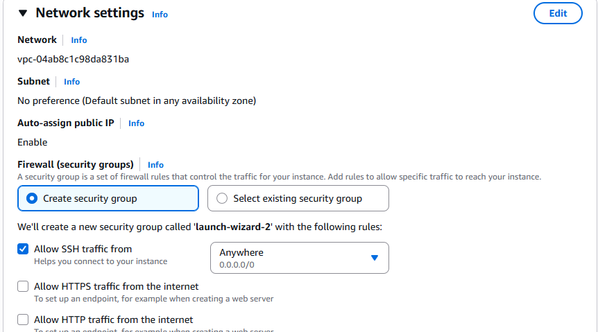

#### Storage

**Default settings are fine:**
- 8 GB gp3 (General Purpose SSD)
- Delete on termination: Yes

For a production app with logs and data, consider 16-20 GB.

### Step 1.4: Launch Instance

1. Review all settings in the **Summary** panel
2. Click **"Launch instance"**
3. Wait for status to show **"Running"** (~2 minutes)
4. Note your **Public IPv4 address** (e.g., `54.123.45.67`)

**Important:** This IP address is how you'll access your server. Write it down!

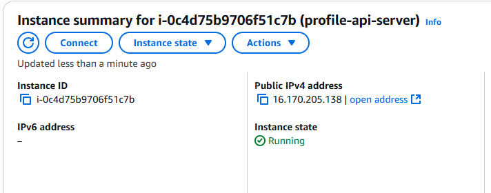

---

## Part 2: Connecting to Your Server

### Step 2.1: Open Terminal/Command Prompt

**Mac/Linux:** Open Terminal application

**Windows:** 
- Option 1: Use Windows PowerShell
- Option 2: Download [PuTTY](https://www.putty.org/)

### Step 2.2: Connect via SSH

**Mac/Linux:**

```bash
ssh -i ~/.ssh/profile-api-key.pem ubuntu@54.123.45.67
```

Replace `54.123.45.67` with your actual EC2 public IP.

**First-time connection warning:**
```
The authenticity of host '54.123.45.67 (54.123.45.67)' can't be established.
ECDSA key fingerprint is SHA256:...
Are you sure you want to continue connecting (yes/no/[fingerprint])? yes
```

Type `yes` and press Enter.

**Successful connection:**
```
Welcome to Ubuntu 22.04.3 LTS (GNU/Linux 6.2.0-1009-aws x86_64)

ubuntu@ip-172-31-45-67:~$
```

You're now inside your EC2 server! 🎉

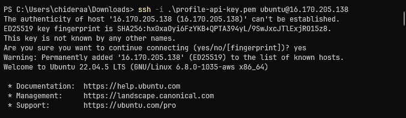

**Windows (PuTTY):**

1. Open PuTTY
2. **Host Name:** `ubuntu@54.123.45.67`
3. **Port:** 22
4. **Connection → SSH → Auth → Credentials:**
   - Browse to your `.ppk` file
5. Click **"Open"**
6. Accept security alert
7. You're connected!

---

## Part 3: Server Setup

Now we'll transform this basic Ubuntu server into a production-ready application server.

### Step 3.1: Update System Packages

Always start by updating the system:

```bash
# Update package lists
sudo apt update

# Upgrade installed packages
sudo apt upgrade -y
```

This ensures you have the latest security patches and bug fixes. It may take 2-5 minutes.

**Understanding the commands:**
- `sudo`: Run as administrator
- `apt`: Ubuntu's package manager
- `update`: Refresh list of available packages
- `upgrade`: Install newer versions of installed packages
- `-y`: Automatically answer "yes" to prompts

### Step 3.2: Install Java 17

Spring Boot requires Java to run:

```bash
# Install OpenJDK 17
sudo apt install openjdk-17-jdk -y

# Verify installation
java -version
```

**Expected output:**
```
openjdk version "17.0.9" 2023-10-17
OpenJDK Runtime Environment (build 17.0.9+9-Ubuntu-122.04)
OpenJDK 64-Bit Server VM (build 17.0.9+9-Ubuntu-122.04, mixed mode, sharing)
```

✅ Java is installed!

**Why Java 17?**
- LTS (Long-Term Support) version
- Required by Spring Boot 3.x
- Performance improvements over Java 11
- Security updates until 2029

### Step 3.3: Install NGINX

NGINX will act as our reverse proxy:

```bash
# Install NGINX
sudo apt install nginx -y

# Start NGINX
sudo systemctl start nginx

# Enable NGINX to start on boot
sudo systemctl enable nginx

# Verify NGINX is running
sudo systemctl status nginx
```

**Expected output:**
```
● nginx.service - A high performance web server and a reverse proxy server
     Loaded: loaded (/lib/systemd/system/nginx.service; enabled)
     Active: active (running) since Sat 2025-10-18 10:00:00 UTC
```

Press `q` to exit the status view.

**Test NGINX:**

Open your web browser and go to:
```
http://54.123.45.67
```

You should see the **"Welcome to nginx!"** page. This confirms NGINX is working and accessible from the internet.

**Understanding systemctl commands:**
- `start`: Start the service now
- `stop`: Stop the service
- `restart`: Stop and start (brief downtime)
- `reload`: Reload configuration (no downtime)
- `enable`: Start automatically on server boot
- `status`: Check if service is running

### Step 3.4: Configure Firewall

Ubuntu includes UFW (Uncomplicated Firewall) for additional security:

```bash
# Allow SSH (port 22) - IMPORTANT: Do this first!
sudo ufw allow 22/tcp

# Allow HTTP (port 80)
sudo ufw allow 80/tcp

# Allow HTTPS (port 443)
sudo ufw allow 443/tcp

# Enable firewall
sudo ufw enable

# Check status
sudo ufw status
```

**Output:**
```
Status: active

To                         Action      From
--                         ------      ----
22/tcp                     ALLOW       Anywhere
80/tcp                     ALLOW       Anywhere
443/tcp                    ALLOW       Anywhere
```

**Why both AWS Security Groups AND UFW?**
- **Defense in depth**: Multiple layers of security
- **AWS Security Groups**: First line of defense (cloud level)
- **UFW**: Second line of defense (server level)

---

## Part 4: Deploying Your Application

### Step 4.1: Transfer Your JAR File

You have two options:

#### Option A: Direct Transfer (Quick)

From your **local machine** (not the EC2 instance):

```bash
# Navigate to your project
cd /path/to/profile-api

# Ensure JAR is built
mvn clean package

# Transfer to EC2
scp -i ~/.ssh/profile-api-key.pem \
    target/profile-api-1.0.0.jar \
    ubuntu@54.123.45.67:/home/ubuntu/
```

**Understanding SCP:**
- `scp`: Secure copy (like `cp` but over SSH)
- `-i`: Specify key file
- Source: Your local JAR file
- Destination: EC2 instance home directory

#### Option B: Using Git (Recommended for Updates)

This method is better for ongoing development:

On your **EC2 instance**:

```bash
# Install Git and Maven
sudo apt install git maven -y

# Clone your repository
cd /home/ubuntu
git clone https://github.com/yourusername/profile-api.git

# Navigate to project
cd profile-api

# Build the project
mvn clean package

# Verify JAR was created
ls -lh target/profile-api-1.0.0.jar
```

**Expected output:**
```
-rw-rw-r-- 1 ubuntu ubuntu 35M Oct 18 10:15 target/profile-api-1.0.0.jar
```

**Benefits of Git method:**
- Easy to update: just `git pull` and rebuild
- Keep track of versions
- No need to transfer files manually

### Step 4.2: Create Application Directory

Organize your deployment properly:

```bash
# Create directory for application
sudo mkdir -p /opt/profile-api

# Move JAR to application directory
sudo mv ~/profile-api-1.0.0.jar /opt/profile-api/
# Or if using Git:
sudo mv ~/profile-api/target/profile-api-1.0.0.jar /opt/profile-api/

# Set correct ownership
sudo chown -R ubuntu:ubuntu /opt/profile-api

# Verify
ls -lh /opt/profile-api/
```

**Why /opt/profile-api?**
- `/opt`: Standard Linux location for optional/third-party software
- Separates application from system files
- Makes backups and updates easier

### Step 4.3: Test Application Manually

Before automating, let's verify the application works:

```bash
# Run the JAR file
java -jar /opt/profile-api/profile-api-1.0.0.jar
```

**You should see:**
```
  .   ____          _            __ _ _
 /\\ / ___'_ __ _ _(_)_ __  __ _ \ \ \ \
( ( )\___ | '_ | '_| | '_ \/ _` | \ \ \ \
 \\/  ___)| |_)| | | | | || (_| |  ) ) ) )
  '  |____| .__|_| |_|_| |_\__, | / / / /
 =========|_|==============|___/=/_/_/_/

Started ProfileApiApplication in 3.456 seconds
```

**Test the endpoint:**

Open a **new terminal** window, SSH into your EC2 instance again:

```bash
ssh -i ~/.ssh/profile-api-key.pem ubuntu@54.123.45.67
```

Then test:

```bash
curl http://localhost:8080/me
```

**Expected response:**
```json
{
  "status": "success",
  "user": {
    "email": "your.email@example.com",
    "name": "Your Name",
    "stack": "Java/Spring Boot"
  },
  "timestamp": "2025-10-18T10:30:45.123Z",
  "fact": "Cats can rotate their ears 180 degrees."
}
```

✅ Application is working!

**Stop the test:** Go back to the first terminal and press `Ctrl+C`

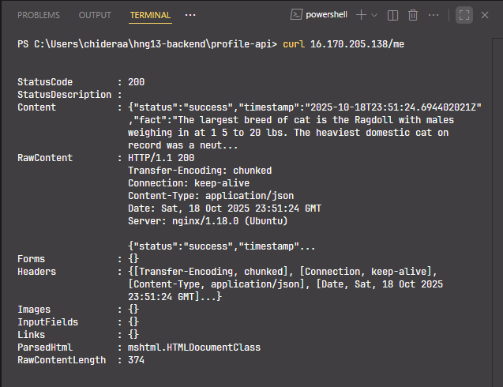

### Step 4.4: Create systemd Service

Running the application manually isn't practical. Let's create a service that:
- Starts automatically on boot
- Restarts if it crashes
- Logs output properly

```bash
sudo nano /etc/systemd/system/profile-api.service
```

**Paste this configuration:**

```ini
[Unit]
Description=Profile API Spring Boot Application
Documentation=https://github.com/yourusername/profile-api
After=syslog.target network.target

[Service]
Type=simple
User=ubuntu
WorkingDirectory=/opt/profile-api
ExecStart=/usr/bin/java -jar /opt/profile-api/profile-api-1.0.0.jar

# Restart policy
Restart=always
RestartSec=10

# Logging
StandardOutput=journal
StandardError=journal
SyslogIdentifier=profile-api

# Security
NoNewPrivileges=true
PrivateTmp=true

# Resource limits
MemoryLimit=512M
CPUQuota=80%

[Install]
WantedBy=multi-user.target
```

**Save and exit:** 
- Press `Ctrl+X`
- Press `Y` to confirm
- Press `Enter` to save

**Understanding the configuration:**

- **[Unit]**: Metadata and dependencies
  - `After=`: Waits for network to be ready
  
- **[Service]**: How to run the application
  - `User=ubuntu`: Runs as non-root user (security)
  - `Restart=always`: Auto-restarts on crash
  - `RestartSec=10`: Waits 10 seconds before restart
  
- **[Install]**: When to start
  - `WantedBy=multi-user.target`: Start on normal boot

- **Security settings:**
  - `NoNewPrivileges=true`: Can't gain more permissions
  - `PrivateTmp=true`: Isolated temporary directory
  
- **Resource limits:**
  - `MemoryLimit=512M`: Don't use more than 512MB RAM
  - `CPUQuota=80%`: Don't use more than 80% of CPU

### Step 4.5: Start and Enable Service

```bash
# Reload systemd (recognizes new service)
sudo systemctl daemon-reload

# Start the service
sudo systemctl start profile-api

# Check status
sudo systemctl status profile-api
```

**Expected output:**
```
● profile-api.service - Profile API Spring Boot Application
     Loaded: loaded (/etc/systemd/system/profile-api.service; disabled)
     Active: active (running) since Sat 2025-10-18 10:30:00 UTC; 5s ago
   Main PID: 12345 (java)
      Tasks: 25 (limit: 1137)
     Memory: 256.0M
        CPU: 5.234s
     CGroup: /system.slice/profile-api.service
             └─12345 /usr/bin/java -jar /opt/profile-api/profile-api-1.0.0.jar
```

✅ Service is running!

**Enable auto-start on boot:**

```bash
sudo systemctl enable profile-api
```

**Output:**
```
Created symlink /etc/systemd/system/multi-user.target.wants/profile-api.service
```

Now your application will start automatically when the server reboots.

### Step 4.6: View Application Logs

systemd captures all output in the journal:

```bash
# View last 50 lines
sudo journalctl -u profile-api -n 50

# Follow logs in real-time
sudo journalctl -u profile-api -f

# View logs since last hour
sudo journalctl -u profile-api --since "1 hour ago"
```

Press `Ctrl+C` to exit real-time logs.

---

## Part 5: Configuring NGINX as Reverse Proxy

Currently, your application runs on port 8080, which isn't accessible from the internet. NGINX will forward public traffic (port 80) to your application.

### Step 5.1: Understanding Reverse Proxy

```
User Request → http://54.123.45.67/me (Port 80)
                     ↓
              NGINX receives request
                     ↓
         NGINX forwards to localhost:8080
                     ↓
           Spring Boot processes request
                     ↓
           Spring Boot sends response
                     ↓
         NGINX forwards response to user
```

### Step 5.2: Remove Default NGINX Site

```bash
sudo rm /etc/nginx/sites-enabled/default
```

This removes the "Welcome to nginx!" page.

### Step 5.3: Create NGINX Configuration

```bash
sudo nano /etc/nginx/sites-available/profile-api
```

**Paste this configuration:**

```nginx
# Upstream definition
upstream spring_boot {
    server 127.0.0.1:8080;
    keepalive 32;
}

# HTTP server
server {
    listen 80;
    listen [::]:80;
    
    # Replace with your EC2 public IP or domain
    server_name 54.123.45.67;
    
    # Logging
    access_log /var/log/nginx/profile-api-access.log;
    error_log /var/log/nginx/profile-api-error.log warn;
    
    # Maximum upload size
    client_max_body_size 10M;
    
    # Proxy to Spring Boot
    location / {
        proxy_pass http://spring_boot;
        
        # Headers (preserve client information)
        proxy_set_header Host $host;
        proxy_set_header X-Real-IP $remote_addr;
        proxy_set_header X-Forwarded-For $proxy_add_x_forwarded_for;
        proxy_set_header X-Forwarded-Proto $scheme;
        
        # Timeouts
        proxy_connect_timeout 60s;
        proxy_send_timeout 60s;
        proxy_read_timeout 60s;
        
        # Connection settings
        proxy_http_version 1.1;
        proxy_set_header Connection "";
    }
    
    # Deny access to hidden files
    location ~ /\. {
        deny all;
        access_log off;
    }
}
```

**IMPORTANT:** Replace `54.123.45.67` with your actual EC2 public IP!

**Save and exit:** `Ctrl+X`, `Y`, `Enter`

**Understanding the configuration:**

- **upstream spring_boot**: Defines backend server (your Spring Boot app)
- **server_name**: Your domain or IP address
- **location /**: Handles all requests
- **proxy_pass**: Forwards to Spring Boot
- **proxy_set_header**: Preserves client information
- **Timeouts**: Prevents hanging connections
- **keepalive 32**: Reuses connections for better performance

### Step 5.4: Enable Configuration

```bash
# Create symbolic link (activates configuration)
sudo ln -s /etc/nginx/sites-available/profile-api /etc/nginx/sites-enabled/

# Test NGINX configuration
sudo nginx -t
```

**Expected output:**
```
nginx: the configuration file /etc/nginx/nginx.conf syntax is ok
nginx: configuration file /etc/nginx/nginx.conf test is successful
```

✅ Configuration is valid!

**If you see errors:**
- Check for typos in the configuration
- Verify your IP address is correct
- Ensure no semicolons are missing

### Step 5.5: Restart NGINX

```bash
sudo systemctl restart nginx

# Verify NGINX is running
sudo systemctl status nginx
```
---

## Part 6: Testing Your Deployed API

### Test from Browser

Open your web browser and navigate to:

```
http://54.123.45.67/me
```

Replace `54.123.45.67` with your actual EC2 public IP.

**You should see:**
```json
{
  "status": "success",
  "user": {
    "email": "your.email@example.com",
    "name": "Your Name",
    "stack": "Java/Spring Boot"
  },
  "timestamp": "2025-10-18T15:30:45.123Z",
  "fact": "Cats have over 20 vocalizations, including the purr, meow, and hiss."
}
```


### Test with curl

```bash
curl http://54.123.45.67/me
```

### Test with Postman

1. Open Postman
2. Create a new GET request
3. Enter URL: `http://54.123.45.67/me`
4. Click **Send**
5. View the JSON response

### Verify Dynamic Data

Refresh multiple times - the `timestamp` and `fact` should change with each request, confirming:
- ✅ Timestamp is dynamic
- ✅ Cat facts are fetched from external API
- ✅ Application is working correctly

🎉 **Congratulations! Your API is now live on AWS!**

---

## Part 7: Adding SSL/HTTPS (Optional but Recommended)

For production applications, SSL/HTTPS is essential for security. Let's add it using Let's Encrypt (free SSL certificates).

### Prerequisites

You need a domain name for SSL. Options:
- **Buy a domain**: Namecheap (~$10/year), GoDaddy, AWS Route 53
- **Free domain**: Freenom (some TLDs are free)

### Step 7.1: Point Domain to EC2

In your domain registrar's DNS settings:

1. Create an **A record**:
   - **Name**: `@` (or leave blank for root domain)
   - **Type**: A
   - **Value**: `54.123.45.67` (your EC2 IP)
   - **TTL**: 300 (5 minutes)

2. Create another **A record** for www:
   - **Name**: `www`
   - **Type**: A
   - **Value**: `54.123.45.67`
   - **TTL**: 300

**Wait for DNS propagation** (5-30 minutes):

```bash
# Check if DNS is working
nslookup yourdomain.com
```

Should return your EC2 IP address.

### Step 7.2: Install Certbot

On your **EC2 instance**:

```bash
# Install Certbot and NGINX plugin
sudo apt install certbot python3-certbot-nginx -y

# Verify installation
certbot --version
```

### Step 7.3: Update NGINX Configuration

```bash
sudo nano /etc/nginx/sites-available/profile-api
```

Change the `server_name` line:

```nginx
server_name yourdomain.com www.yourdomain.com;
```

Replace `yourdomain.com` with your actual domain.

**Save and test:**

```bash
sudo nginx -t
sudo systemctl reload nginx
```

### Step 7.4: Obtain SSL Certificate

```bash
sudo certbot --nginx -d yourdomain.com -d www.yourdomain.com
```

**Follow the prompts:**

1. **Enter email address**: For renewal notifications
   ```
   Enter email address: your.email@example.com
   ```

2. **Agree to Terms of Service**: Type `Y`
   ```
   (A)gree/(C)ancel: A
   ```

3. **Share email with EFF**: Your choice (`Y` or `N`)

4. **HTTP to HTTPS redirect**: Choose `2` (recommended)
   ```
   1: No redirect
   2: Redirect - Make all requests redirect to secure HTTPS access
   Select: 2
   ```

**Certbot will:**
- ✅ Verify domain ownership
- ✅ Obtain SSL certificate from Let's Encrypt
- ✅ Automatically configure NGINX for HTTPS
- ✅ Set up HTTP to HTTPS redirect
- ✅ Configure auto-renewal

**Expected output:**
```
Successfully received certificate.
Certificate is saved at: /etc/letsencrypt/live/yourdomain.com/fullchain.pem
Key is saved at: /etc/letsencrypt/live/yourdomain.com/privkey.pem
This certificate expires on 2026-01-16.
These files will be updated when the certificate renews.
Certbot has set up a scheduled task to automatically renew this certificate.

Deploying certificate
Successfully deployed certificate for yourdomain.com
Successfully deployed certificate for www.yourdomain.com
Congratulations! You have successfully enabled HTTPS
```

### Step 7.5: Test SSL

Visit your site with HTTPS:

```
https://yourdomain.com/me
```

You should see:
- 🔒 Padlock icon in browser (secure connection)
- Your JSON response
- HTTP requests redirect to HTTPS automatically

**Verify SSL certificate:**

```bash
# Check certificate details
sudo certbot certificates
```

**Test auto-renewal:**

```bash
# Dry run (simulates renewal without actually doing it)
sudo certbot renew --dry-run
```

**Expected output:**
```
Congratulations, all simulated renewals succeeded
```

Certbot automatically renews certificates before expiration (every 60 days).

---

## Monitoring and Maintenance

### View Logs

**Application logs:**
```bash
# Real-time logs
sudo journalctl -u profile-api -f

# Last 100 lines
sudo journalctl -u profile-api -n 100

# Errors only
sudo journalctl -u profile-api -p err
```

**NGINX logs:**
```bash
# Access log (all requests)
sudo tail -f /var/log/nginx/profile-api-access.log

# Error log
sudo tail -f /var/log/nginx/profile-api-error.log
```

### Check Service Status

```bash
# Application status
sudo systemctl status profile-api

# NGINX status
sudo systemctl status nginx

# Check if ports are open
sudo netstat -tlnp | grep -E ':(80|443|8080)'
```

### Update Your Application

When you make changes:

```bash
# Build new JAR locally
mvn clean package

# Transfer to EC2
scp -i ~/.ssh/profile-api-key.pem \
    target/profile-api-1.0.0.jar \
    ubuntu@54.123.45.67:/home/ubuntu/

# SSH into EC2
ssh -i ~/.ssh/profile-api-key.pem ubuntu@54.123.45.67

# Stop service
sudo systemctl stop profile-api

# Backup old version (optional)
sudo cp /opt/profile-api/profile-api-1.0.0.jar \
       /opt/profile-api/profile-api-backup.jar

# Replace with new version
sudo mv /home/ubuntu/profile-api-1.0.0.jar /opt/profile-api/

# Start service
sudo systemctl start profile-api

# Verify it's running
sudo systemctl status profile-api
```

### Server Maintenance

```bash
# Update system packages (monthly recommended)
sudo apt update && sudo apt upgrade -y

# Check disk space
df -h

# Check memory usage
free -h

# Check CPU usage
top
# Press 'q' to exit
```

---

## Cost Management

### Free Tier Usage

Monitor your usage to stay within free tier:

1. **AWS Console** → **Billing Dashboard**
2. Set up **Budget Alerts**:
   - Create budget: $10/month
   - Get email at 80% and 100%

### Estimated Costs After Free Tier

- **EC2 t3.micro**: ~$8-10/month
- **Data transfer**: First 15 GB free, then $0.09/GB
- **Elastic IP**: Free when attached to running instance
- **Total**: ~$10-15/month for small traffic

### Cost Optimization Tips

1. **Stop instance when not needed** (for demos/testing):
   ```bash
   # From local machine with AWS CLI
   aws ec2 stop-instances --instance-ids i-1234567890abcdef0
   ```
   **Note**: Public IP changes unless using Elastic IP

2. **Use Elastic IP** (prevents IP changes):
   - AWS Console → EC2 → Elastic IPs
   - Allocate new address
   - Associate with your instance
   - **Free** when attached to running instance
   - **$0.005/hour** when not attached (remember to release if not needed)

3. **Monitor traffic** to avoid unexpected data transfer charges

---

## Troubleshooting Common Issues

### Issue: Cannot SSH into EC2

**Check:**
1. Instance is running (AWS Console)
2. Security group allows SSH from your IP
3. Using correct key file and IP address
4. Key file has correct permissions: `chmod 400 ~/.ssh/profile-api-key.pem`

### Issue: 502 Bad Gateway

**Cause**: NGINX can't reach Spring Boot

**Fix:**
```bash
# Check if application is running
sudo systemctl status profile-api

# If not running, start it
sudo systemctl start profile-api

# Check logs for errors
sudo journalctl -u profile-api -n 50
```

### Issue: Application Won't Start

**Check logs:**
```bash
sudo journalctl -u profile-api -n 100
```

**Common causes:**
1. Port 8080 already in use
2. Insufficient memory
3. Wrong Java version
4. JAR file missing or corrupted

### Issue: High Memory Usage

**Solution - Limit Java heap:**

```bash
sudo nano /etc/systemd/system/profile-api.service
```

Add to `[Service]` section:
```ini
Environment="JAVA_OPTS=-Xmx384m -Xms128m"
```

```bash
sudo systemctl daemon-reload
sudo systemctl restart profile-api
```

---

## Key Takeaways

By deploying to AWS EC2 with NGINX, you've learned:

### Technical Skills
✅ **Cloud Infrastructure**: AWS EC2, Security Groups, Elastic IPs  
✅ **Linux Administration**: Ubuntu server management, SSH  
✅ **Web Servers**: NGINX configuration, reverse proxy  
✅ **Process Management**: systemd services, auto-restart  
✅ **Security**: Firewall configuration, SSL/TLS, Let's Encrypt  
✅ **Networking**: Understanding ports, proxies, HTTP/HTTPS  
✅ **Troubleshooting**: Log analysis, service debugging  

### DevOps Practices
✅ **Infrastructure as Code**: Reproducible deployment steps  
✅ **Monitoring**: Log aggregation, service health checks  
✅ **Security**: Defense in depth, principle of least privilege  
✅ **High Availability**: Auto-restart, graceful handling of failures  

### Resume-Worthy Skills
- Deployed production Java application to AWS
- Configured NGINX as reverse proxy
- Implemented SSL/TLS encryption
- Managed Linux servers via SSH
- Configured systemd services for high availability

---

## Next Steps

### Enhance Your Deployment

1. **Add Monitoring**:
   - AWS CloudWatch for metrics
   - Application Performance Monitoring (APM)

2. **Implement CI/CD**:
   - GitHub Actions for automated deployments
   - Jenkins or GitLab CI

3. **Database Integration**:
   - Add PostgreSQL or MySQL
   - Use AWS RDS for managed database

4. **Load Balancing**:
   - Add Application Load Balancer
   - Deploy multiple instances

5. **Containerization**:
   - Create Docker image
   - Deploy to AWS ECS or EKS

### Alternative Deployments

If AWS seems too complex for your needs, consider:
- **Render**: Simple PaaS with GitHub integration
- **Fly.io**: Global deployment, always-on free tier
- **Google Cloud Run**: Serverless containers

---

## Conclusion

Deploying to AWS EC2 with NGINX provides invaluable experience in managing production infrastructure. While PaaS solutions offer convenience, understanding the underlying infrastructure makes you a more capable and versatile developer.

This deployment demonstrates not just coding skills, but the ability to:
- Manage cloud resources
- Configure web servers
- Implement security best practices
- Troubleshoot production issues
- Maintain running applications

These are the skills that distinguish junior developers from those ready for production responsibilities.

**Your API is now:**
- ✅ Publicly accessible
- ✅ Running on professional cloud infrastructure
- ✅ Automatically restarting on failures
- ✅ Secured with firewall rules
- ✅ (Optional) Encrypted with SSL/TLS
- ✅ Production-ready!

---

*For detailed troubleshooting, backup procedures, and advanced configurations, see the complete [DEPLOYMENT.md](https://github.com/yourusername/profile-api/blob/main/DEPLOYMENT.md) in the repository.*

---

## Lessons Learned: Common Pitfalls and Solutions

During development, I encountered several issues that provided valuable learning opportunities. Here's what went wrong and how to avoid these mistakes.

### Issue #1: The Missing @GetMapping Annotation

**The Problem:**
After building the controller, tests were failing with 404 errors:

```
Status expected:<200> but was:<404>
No static resource me.
```

**The Cause:**
I forgot to add the `@GetMapping("/me")` annotation to the controller method:

```java
@RestController
public class ProfileController {
    
    @Autowired
    private CatFactService catFactService;

    // ❌ Missing @GetMapping!
    public ResponseEntity<ProfileResponse> getProfile() {
        // ...
    }
}
```

Without `@GetMapping`, Spring doesn't know this method should handle HTTP requests to `/me`. It was looking for a static file instead.

**The Solution:**
Always ensure your controller methods have the appropriate mapping annotation:

```java
@GetMapping("/me")  // ✅ Required!
public ResponseEntity<ProfileResponse> getProfile() {
    // ...
}
```

**Lesson:** Annotations are not decorative—they're instructions to the framework. Missing a single annotation can break functionality entirely.

---

### Issue #2: Deprecated @MockBean in Spring Boot 3.4+

**The Problem:**
Initial tests used `@MockBean` which is deprecated in Spring Boot 3.4+:

```java
@MockBean  // ❌ Deprecated
private CatFactService catFactService;
```

**The Cause:**
Spring Boot 3.4 introduced a new testing infrastructure with `@MockitoBean` to better integrate with modern testing practices.

**The Solution:**
Update to the new annotation:

```java
import org.springframework.test.context.bean.override.mockito.MockitoBean;

@MockitoBean  // ✅ Current approach
private CatFactService catFactService;
```

**Lesson:** Framework APIs evolve. Always check the documentation for your specific version and be prepared to update deprecated code.

---

### Issue #3: Incorrect Builder Pattern Usage

**The Problem:**
Initially, I tried to set nested object fields directly on the parent:

```java
ProfileResponse response = ProfileResponse.builder()
    .status("success")
    .email("my_email@gmail.com")      // ❌ Wrong level
    .name("Chideraa Ude")              // ❌ Wrong level
    .stack("Java/Spring Boot")         // ❌ Wrong level
    .timestamp(timestamp)
    .fact(catFact)
    .build();
```

**The Cause:**
The `email`, `name`, and `stack` fields belong to the nested `UserInfo` class, not the parent `ProfileResponse` class. Lombok's `@Builder` generates separate builders for each class.

**The Solution:**
Build the nested object first, then pass it to the parent:

```java
// Build nested object first
ProfileResponse.UserInfo userInfo = ProfileResponse.UserInfo.builder()
    .email("my_email@gmail.com")
    .name("Chideraa Ude")
    .stack("Java/Spring Boot")
    .build();

// Use it in parent
ProfileResponse response = ProfileResponse.builder()
    .status("success")
    .user(userInfo)  // ✅ Pass the built object
    .timestamp(timestamp)
    .fact(catFact)
    .build();
```

**Lesson:** Understand your data structures. Nested objects require separate instantiation before being passed to parent objects.

---

### Issue #4: Package Naming Mismatches

**The Problem:**
Tests were failing because the package structure didn't match between configuration and actual code:

```
Expected: com.chideraau.profile_api
Actual:   chideraau.profileapi
```

**The Cause:**
Inconsistency between Spring Initializr's generated packages and manually created ones.

**The Solution:**
Ensure all Java files use consistent package naming:

```java
// All controllers
package com.chideraau.profile_api.controller;

// All models
package com.chideraau.profile_api.model;

// All services
package com.chideraau.profile_api.service;

// All tests
package com.chideraau.profile_api;
```

Also verify `pom.xml`:

```xml
<groupId>com.chideraau</groupId>
<artifactId>profile-api</artifactId>
```

**Lesson:** Package naming conventions matter. Spring's component scanning depends on consistent package structures. When in doubt, stick with what Spring Initializr generates.

---

### Issue #5: Lombok's @Builder.Default Confusion

**The Problem:**
Lombok warned about field initialization with `@Builder`:

```java
@Builder
private UserInfo user = new UserInfo();  // ⚠️ Warning
```

**The Warning:**
```
@Builder will ignore the initializing expression entirely. 
If you want the initializing expression to serve as default, 
add @Builder.Default.
```

**The Cause:**
When using `@Builder`, Lombok generates a builder class that sets all fields. Direct initialization is ignored unless marked with `@Builder.Default`.

**The Solution:**
Remove the initialization and build the object explicitly when needed, or use `@Builder.Default` if a default value is genuinely required:

```java
@Builder
private UserInfo user;  // ✅ No initialization

// Or if default is needed:
@Builder.Default
private UserInfo user = new UserInfo();  // ✅ With annotation
```

**Lesson:** Annotation processors like Lombok have specific rules. Read compiler warnings carefully—they often prevent subtle bugs.

---

## Best Practices and Production Considerations

### 1. Environment-Specific Configuration

Use environment variables for sensitive data and environment-specific settings:

```java
@Value("${api.external.url:https://catfact.ninja/fact}")
private String externalApiUrl;
```

In `application.properties`:
```properties
api.external.url=${EXTERNAL_API_URL:https://catfact.ninja/fact}
```

### 2. Error Handling with @ControllerAdvice

For production, implement global exception handling:

```java
@RestControllerAdvice
public class GlobalExceptionHandler {
    
    @ExceptionHandler(Exception.class)
    public ResponseEntity<ErrorResponse> handleException(Exception e) {
        ErrorResponse error = new ErrorResponse(
            "error",
            e.getMessage(),
            Instant.now().toString()
        );
        return ResponseEntity.status(HttpStatus.INTERNAL_SERVER_ERROR).body(error);
    }
}
```

### 3. API Versioning

Consider versioning your API from the start:

```java
@GetMapping("/api/v1/me")
public ResponseEntity<ProfileResponse> getProfile() {
    // ...
}
```

### 4. Rate Limiting

For public APIs, implement rate limiting to prevent abuse:

```java
@Configuration
public class RateLimitConfig {
    @Bean
    public RateLimiter rateLimiter() {
        return RateLimiter.create(100.0); // 100 requests per second
    }
}
```

### 5. Monitoring and Observability

Add Spring Boot Actuator for production monitoring:

```xml
<dependency>
    <groupId>org.springframework.boot</groupId>
    <artifactId>spring-boot-starter-actuator</artifactId>
</dependency>
```

This provides endpoints like:
- `/actuator/health` - Application health status
- `/actuator/metrics` - Application metrics
- `/actuator/info` - Application information

---

## Conclusion

Building a RESTful API with Spring Boot involves understanding several interconnected concepts:

1. **REST principles** and HTTP protocol
2. **Spring's dependency injection** and component model
3. **JSON serialization** with Jackson
4. **Builder pattern** for clean object construction
5. **Service layer pattern** for business logic separation
6. **Testing strategies** (unit vs. integration tests)
7. **Cloud deployment** and continuous delivery

The key takeaways:
- **Annotations drive behavior** in Spring—missing one can break functionality
- **Proper layering** (Controller → Service → Model) keeps code maintainable
- **Testing is non-negotiable**—it catches issues before production
- **Error handling** must be thoughtful—external dependencies will fail
- **Package structure matters**—Spring's component scanning depends on it

This project serves as a foundation for more complex applications. You can extend it by:
- Adding database integration with Spring Data JPA
- Implementing authentication with Spring Security
- Creating additional endpoints (POST, PUT, DELETE)
- Adding request validation with `@Valid` annotations
- Integrating with message queues (RabbitMQ, Kafka)

---

## Resources

- [Spring Boot Documentation](https://spring.io/projects/spring-boot)
- [Spring Framework Reference](https://docs.spring.io/spring-framework/docs/current/reference/html/)
- [Railway Documentation](https://docs.railway.app/)
- [REST API Best Practices](https://restfulapi.net/)
- [Baeldung Spring Tutorials](https://www.baeldung.com/spring-tutorial)

---

## Complete Source Code

The complete source code for this project is available on GitHub:
[github.com/chideraa-ude/profile-api](https://github.com/chideraa-ude/profile-api)

---

**Thank you for reading!** If you found this helpful, please share it with others learning Spring Boot. Feel free to leave questions in the comments below.

Happy coding! 🚀

---

*Tags: #SpringBoot #Java #REST #API #WebDevelopment #Backend #Tutorial*